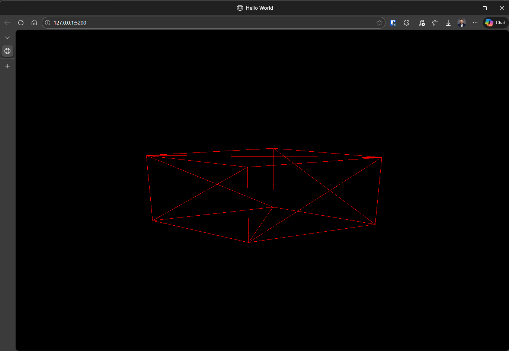

# Three.js-Course
Code for the exercises from Simon Dev. The lessons ae separated in branches.

# Hello World
Using the best practices, it creates a simple scene containing a camera and a mesh.
The camera can be rotated by dragging the mouse on top of the scene.

## Requirements
* node
* npm

## Run
1. Clone this repository
2. Install dependencies `npm install`
3. Run the project with `npm run dev`
